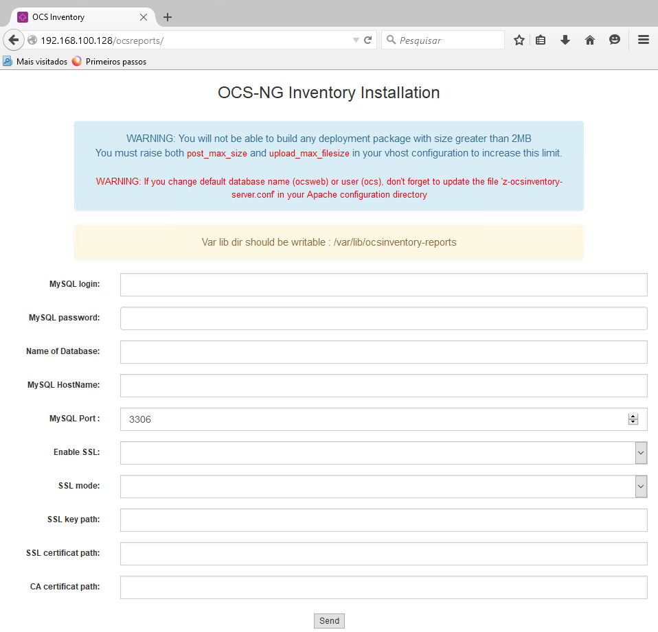

# Instalação OCS

### Baixando o arquivo

Para baixar o OCS Inventory, é necessário ir a [página de download](https://ocsinventory-ng.org/?page_id=1548&lang=en) e cadastrar um email para receber o link de download.

Faça download do OCSInventory em seu contexto unix.
> Utilizei o comando `curl -L -O LINK_DO_ARQUIVO.tar.gz`

Neste passo, você deve ter um arquivo `OCSNG_UNIX_SERVER-2.12.3.tar.gz` baixado no linux.

### Instalando

Primeiramente, descompacte o arquivo:
```shell
$ tar -xvzf OCSNG_UNIX_SERVER-2.12.3.tar.gz
```

E entre na diretório do criada:
```shell
$ cd OCSNG_UNIX_SERVER-2.12.3.tar.gz
```

No diretório execute o setup com:
```shell
$ sudo sh setup.sh
```

> Ao executar, vários prompts vão aparecer na tela, perguntando locais de arquivos e outras configurações. É possível pressionar repetitivamente a tecla 'Enter' para aceitar as configurações padrão.

Após realizar a instalação, ative o OCS e reinicialize o serviço do apache2 rodando:
```shell
$ sudo a2enconf ocsinventory-reports
$ sudo systemctl reload apache2 && sudo systemctl restart apache2
```

> Digite `$ sudo systemctl status apache2` pare verificar se o serviço do apache está rodando normalmente.

### Configurando

Com instalação completa, passamos aos passos de configuração. O serviço apache2 estará rodando uma interface em `http://IP_LOCAL_DA_MAQUINA/ocsreports`.




