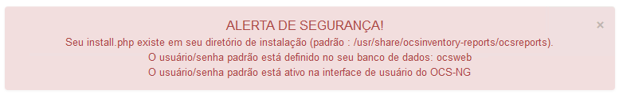

# Instalação OCS

### Baixando o arquivo

Para baixar o OCS Inventory, é necessário ir a [página de download](https://ocsinventory-ng.org/?page_id=1548&lang=en) e cadastrar um email para receber o link de download.

Faça download do OCSInventory em seu contexto unix.
> Utilizei o comando `curl -L -O LINK_DO_ARQUIVO.tar.gz`

Neste passo, você deve ter um arquivo `OCSNG_UNIX_SERVER-2.12.3.tar.gz` baixado no linux.

### Instalando

Primeiramente, descompacte o arquivo:
```console
$ tar -xvzf OCSNG_UNIX_SERVER-2.12.3.tar.gz
```

E entre na diretório do criada:
```console
$ cd OCSNG_UNIX_SERVER-2.12.3.tar.gz
```

No diretório execute o setup com:
```console
$ sudo sh setup.sh
```

> Ao executar, vários prompts vão aparecer na tela, perguntando locais de arquivos e outras configurações. É possível pressionar repetitivamente a tecla 'Enter' para aceitar as configurações padrão.

Após realizar a instalação, ative o OCS e reinicialize o serviço do apache2 rodando:
```console
$ sudo a2enconf ocsinventory-reports
$ sudo a2enconf z-ocsinventory-server
$ sudo systemctl reload apache2 && sudo systemctl restart apache2
```

> Digite `$ sudo systemctl status apache2` pare verificar se o serviço do apache está rodando normalmente.

### Configurando

Com instalação completa, passamos aos passos de configuração. O serviço apache2 estará rodando uma interface em `http://IP_LOCAL_DA_MAQUINA/ocsreports`.


Este painel será responsável por criar o banco de dados do 'Management Server'.

Configurei o meu com o seguinte:
- MySQL login: ocs
- Password: ocs
- Name of Database: ocsweb
- MySQL hostname: localhost
- MySQL port: 3306

Após criar o banco de dados, vá para `http://IP_LOCAL_DA_MAQUINA/ocsreports/index.php`.

O login e senha padrão é **admin** e **admin**.

--- 

Após logar, você será apresentado com um aviso no topo da tela:



Vamos tratar destes problemas. Começando pelo mais fácil:


 - **O usuário/senha padrão está ativo na interface de usuário do OCS-NG**


Para mudar a senha padrão do login admin, na página do OCSInventory, clique nas configurações (canto superior direito) e "Minha Conta".

Na página de configuração, preencha os campos "Primeiro Nome" e "Senha".


- **Seu install.php existe em seu diretório de instalação (padrão : /usr/share/ocsinventory-reports/ocsreports).**


Para tratar deste aviso, removemos o 'install.php' da pasta do OCS:
```console
$ sudo rm /usr/share/ocsinventory-reports/ocsreports/install.php
```


 

- **O usuário/senha padrão está definido no seu banco de dados: ocsweb**

Para tratar do ultimo aviso, mudamos a senha do banco 'ocsweb' criado em [2 - instalação dos modulos requeridos](2 - Instalação dos modulos requeridos pelo OCS.md):

1. Abra uma conexão com o banco de dados:
```console
$ sudo mysql -u root -p
```
2. Mude a senha e usuário do banco ocsweb (Substitua USUARIO e SENHA):
```sql
GRANT ALL PRIVILEGES ON ocsweb.* TO 'USUARIO'@'localhost' IDENTIFIED BY 'SENHA' WITH GRANT OPTION;
SET PASSWORD FOR 'ocs'@'localhost' = PASSWORD("SENHA");
FLUSH PRIVILEGES;
```
3. Adicione este novo usuário e senhas para os arquivos de configuração, você pode usar um editor de texto no terminal (como vim) para editar os seguintes arquivos:
> Note que estes arquivos são 'read only' então garanta permissões ao seu usuário ou use o sudo

Em `/usr/share/ocsinventory-reports/ocsreports/dbconfig.inc.php`:
```php
define("DB_NAME", "ocsweb");
define("SERVER_READ", "localhost");
define("SERVER_WRITE", "localhost");
define("COMPTE_BASE", "ocs");
define("PSWD_BASE", "SENHA"); // EDITE ESSA LINHA, SUBSTITUA 'SENHA' PELA SENHA DO PASSO ANTERIOR
```

Em `/etc/apache2/conf-available/z-ocsinventory-server.conf`:
```conf
...
# User allowed to connect to database
PerlSetEnv OCS_DB_USER USUARIO
# Password for user
PerlSetVar OCS_DB_PWD SENHA
...
```
Novamente, Substitua USUARIO e SENHA pelo usuário e senha escolhido no passo anterior.

--- 

Agora os servidores do OCSInventory estão configurados.


