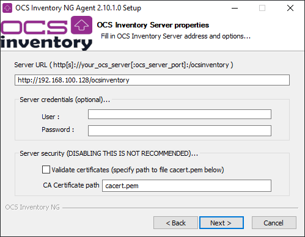
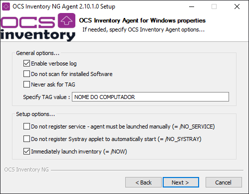

# Instalação Cliente

Para realizar a Instalação do cliente, você deve ter [baixado o instalador](https://ocsinventory-ng.org/?page_id=1548&lang=en) EXE do cliente, que está no mesmo e-mail recebido para o instalador do servidor.

---

Extraia o arquivo `OCS-Windows-Agent-2.10.1.0_x64.zip` e execute.

Pressione 'avançar' até chegar a terceira tela:

Substitua o endereço pelo IP de seu servidor, no meu caso `192.168.100.128` e desmarque a _checkbox_ do certificado e pressione para avançar.

A próxima página do instalador são as configurações de proxy, que não se aplicam a nossa instalação, então avance.

Nesta tela, marque a opção do log verboso (que irá te ajudar a debugar se algo der errado) e escreva uma TAG para o computador (este nome aparecerá no dashboard).

A última opção enviará um inventário imediatamente após a instalação, o que pode causar tráfego na rede dependendo da quantidade de clientes conectados, caso ela não esteja ativa, **o primeiro log pode demorar até 10 horas para aparecer**.

As telas restantes do instalador podem ser avançadas sem configurações adicionais.

